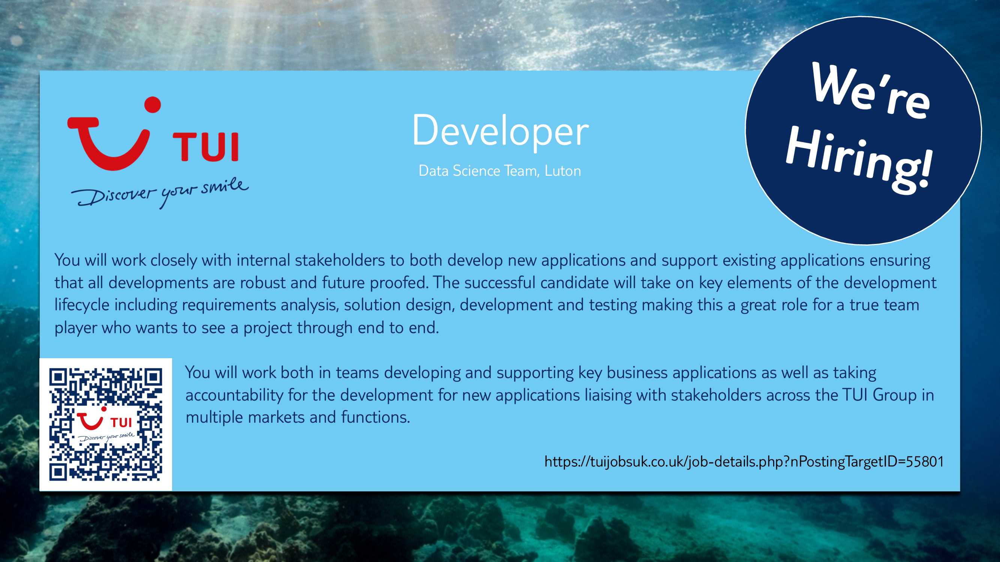

# TUI &amp; Bedfordshire University Hackathon 2018

The theme for this years TUI / Bedfordshire University hackathon is `In-Resort Experience`.  In other words - based around the kinds of services and products that TUI - its in-resort suppliers and partners - supply to its customers while they are actually on holiday.

For several of this years scenarios - you will need the data shown in the appendix below.  Whilst this is typical of the kinds of in-resort products & services TUI offer (known as ancillaries) - this list has been significantly simplified and reduced.  In particular, the pricing scheme below bears no relation to the one actually in use at TUI.

As this years hackathon is 1 day (24 hours) in length, the complexity of the scenarios has been reduced accordingly to reflect this change.

As always - the choice of scenario(s), tools, testing & design techniques and language(s) is left to each team.

It is perfectly acceptable (even desirable) for some of the elements in your solution to be 'faked', for example: the 'app' mentioned throughout could be a simple command line program, user interactions could be randomised to simulate actual situations and so on.

Happy hacking!

# Example scenarios
### Oh, Bugger - [Scenario Details](scenarios/oh-bugger.md)
> Identifying photos of beetles so that customers can find the most elusive and rare specimens

### Check the rep - [Scenario Details](scenarios/check-the-rep.md)
> Effective communication between customers and their holiday rep

### Where next? - [Scenario Details](scenarios/where-next.md)
> A digital art piece showcasing the live bookings made by TUI customers all over the world

### Where's my child?! - [Scenario Details](scenarios/wheres-my-child.md)
> Check-in and monitoring system for parents with kids in activities

### You talking to me?! - [Scenario Details](scenarios/you-talking-to-me.md)
> Personalised digital signage that only shows adverts relevent to those passing by

### A load of bull - [Scenario Details](scenarios/a-load-of-bull.md)
> A game designed to limit customer's contact with the rep

### Checkout - [Scenario Details](scenarios/checkout.md)
> A checkout service for the in-resort app

### Inventory - [Scenario Details](scenarios/inventory.md)
> An inventory service for the in-resort app

### Payment - [Scenario Details](scenarios/payment.md)
> A payment service for the in-resort app


# Appendix - In-Resort Ancillaries

Prices given here are for illustration purposes only - they do not reflect actual values.

The availability given (how many are available to the customer) is based on a per hotel basis.


```bash
Code | Name                                    | Price   | Availability
-----|-----------------------------------------|---------|-------------
0001 | Taxi Transfer - Airport to Hotel Return | £100.00 | Unlimited
0002 | Baby Cot Hire - 7 Days                  | £80.00  | 10
0003 | Car Hire - 7 Days                       | £25.00  | 10
0004 | Attraction Ticket - Per Person          | £50.00  | Unlimited
0005 | Wedding                                 | £400.00 | 7
0006 | Excursion - Per Person                  | £40.00  | Unlimited
0007 | Sunbed Hire - 7 Days                    | £100.00 | 100
```

For those adventurous, talented, exceptional, or plain crazy - the following scenarios are designed so they can be combined together:

* checkout + inventory
* inventory + payment
* checkout + inventory + payment

Another option is for multiple teams to work together on all 3 of these scenarios, providing a seamless integration between them and offer a single - unified - solution.


